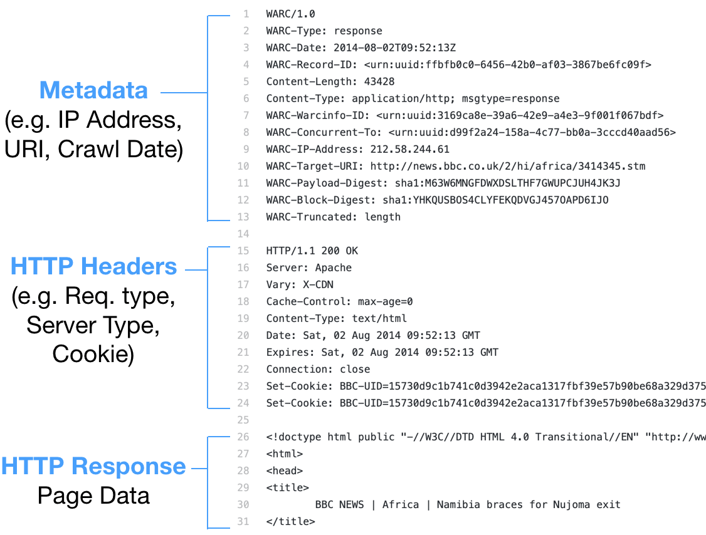

## Big Data & Machine Learning for B2B Marketers

*By: Saleem Khan* 

# Key Takeaways
  - **25.1%**  
    - The approximate percentage of websites that can be classified as businesses or e-commerce related on the open web.
  - **650 Million** 
    - The number of web pages that are potential businesses that B2B marketers could market to. This number is based on 2.6 Billion web pages collected in February of 2020 by a web archive called Common Crawl.
  - **11 to 1** 
    - Based on the above analysis, for every 11 people in the world there is one business.

# Background
In this excercise I will be examining the use of web archive data to produce valuable insights and data assets for B2B marketers. Specifically, knowing whether a website is a business or not is a very important first step. I will be walking through the steps required to produce a dataset that can put data scientists on a path to extracting this valuable information for their marketing teams. 

# Problem Statement
  - **Is it possible to use data from the web to identify businesses?**
  
    I wanted to develop a machine learning model that can look at the raw text of a web page and determine whether it is a business or not. 
   
# Goal
The ultimate goal here is to use a classifier to produce a curated list of business websites that can then be further categorized based on keywords. These further categorizations will, for instance, classify a business as being a pizza parlor, a flower shop or a bank. This sort of information is key in targeted B2B marketing. A final goal would be to pull all relevant contact information such as e-mail  phone and address.

# Approach
The approach I will be taking here is threefold:

**1) Dataset** 

  

  [Common Crawl](http://www.commoncrawl.org) is an open repository of web crawl data. This data is refreshed monthly with a history that goes back to 2011. Each month contains nearly 260 Terabytes of information. To put this number in perspective, if you were to print out all this monthly information you would have a stack of papers about 16,000 miles tall. That is enough to wrap more than half way around the circumfernce of the Earth. All of the data in CommonCrawl from 2011 to the present day would take you to the moon and back over 6 times!

**2) Classification**

  

  [scikit-learn](https://scikit-learn.org/) is a simple and powerful library built on Python's numpy and pandas frameworks. This library provides great machine learning capabilites. I will be focused on classification models since my goal will be to determine whether a website is a business or not. The model that I develop here will be created on a subset of my data and will eventually be used on a larger dataset of Common Crawl data.

**3) Big Data Processing**

<table>
  <tr>
    <td></td>
    <td></td>
    <td></td>
  </tr>
<table>
  
  The last item here is to run my classification model against a random sample of Common Crawl data. Since this is such a large dataset, I will need to use technology that allows me to parallelize the task and work efficiently to extract the classifications I'm looking for. I will be using [Apache Spark](https://spark.apache.org/) which is a highly efficient data processing tools that uses Directed Acyclic Graphs (DAG) to process data and stores the output in Resilient Distributed Datasets (RDD). I will also be using the Amazon Web Services (AWS) cloud, specifically AWS Elastic Map Reduce (EMR) and AWS Simple-Storage-Solution (S3) in order to run my Spark job and analyze Common Crawl data.

# Step 1 - Dataset

Common Crawl crawls the web and freely provides its archived datasets to the public. Web archives consist of petabytes of data collected since 2011. The archived data comes in three distinct file formats:

1. WARC - this is a web archive file that contains the raw data collected from each web page that was crawled
2. WAT - metadata extracted from a WARC file which shows information like the HTTP request, reponse and associated metadata (e.g. server type, IP address & cookie information)
3. WET - plain text extracted from the WARC file. This includes the payload of the webpage and some basic metadata like the URI.
    
Here is a view of an actual WARC file:

  

# Conclusion

**Final Thoughts**

**Code** - All python code for this project can be found in my GitHub respository: [GitHub](https://github.com/skhan-tech/BusinessClassifier)
