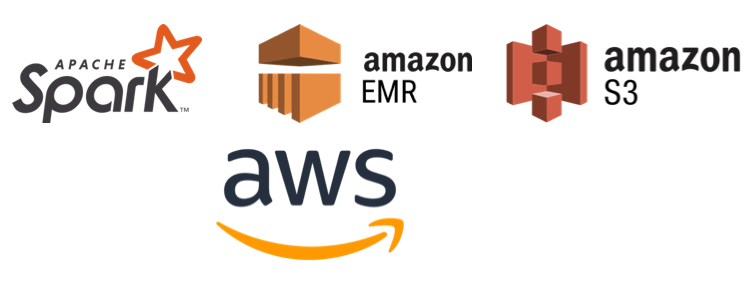
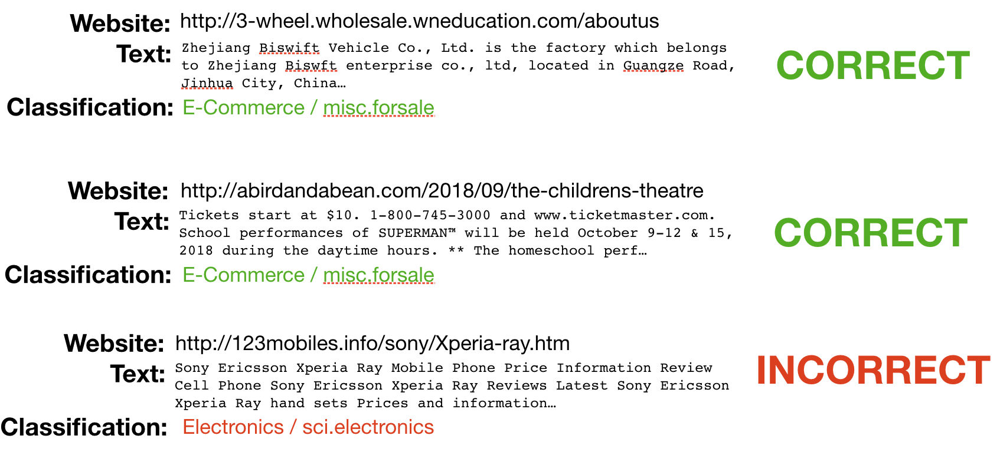
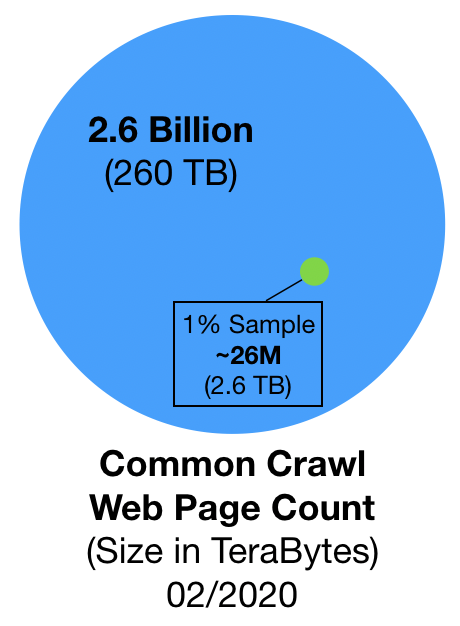

## Big Data & Machine Learning for B2B Marketers

*By: Saleem Khan* 

# Key Takeaways
  - **25.1%**  
    - The approximate percentage of websites that can be classified as businesses or e-commerce related on the open web.
  - **650 Million** 
    - The number of web pages that are potential businesses that B2B marketers could market to. This number is based on 2.6 billion web pages collected in February of 2020 by a web archive called Common Crawl.
  - **11 to 1** 
    - Based on the above analysis and roughly speaking, for every 11 people in the world there is one business.

# Background
In this excercise I will be examining the use of web archive data to produce valuable insights and data assets for Business-to-Business (B2B) marketers. B2B marketers are looking for accurate business information in order to precisely target certain kinds of businesses. There are traditional methods of using directories and business registries but the most up-to-date information on a business can usually be found on its website. Therefore, knowing whether a website is a business website or not is a valuable first step for marketers to have up-to-date and highly accurate information on the audiences they are targeting. In this blog post, I will be walking through the steps required to produce a dataset that can put data scientists on a path to extracting this valuable information for their marketing teams. 

# Problem Statement
  - **Is it possible to use data from the web to identify businesses?**
  
    I wanted to develop a machine learning model that can look at the raw text of a web page and determine whether it is a business or not. 
   
# Goal
The ultimate goal here is to use a classification model to produce a curated list of business websites that can then be further categorized based on keywords. These further categorizations will, for instance, classify a business as being a bank or a grocery store. One example use-case here would be a company that manufactures cardboard boxes for pizza delivery. This sort of company will mainly sell to pizza parlors. Their marketing team would need an accurate and holistic dataset of pizza parlors in their region or country to effectively market to this audince. This sort of information is key in effective B2B marketing. A final goal would be to pull all relevant contact information such as e-mail, phone and address so marketers can then communicate with each business.

# Approach
The approach I will be taking here is threefold:

**1) Dataset** 

[Common Crawl](http://www.commoncrawl.org) is an open repository of web crawl data. This data is refreshed monthly with a history that goes back to 2011. Each month contains nearly 260 terabytes of information. To put this number in perspective, if you were to print out all this monthly information you would have a stack of papers about 16,000 miles tall. That is enough to wrap more than half way around the circumfernce of the Earth. All of the data in CommonCrawl, from 2011 to the present day,  would take you to the moon and back over 6 times!

**2) Classification**

[scikit-learn](https://scikit-learn.org/) is a simple and powerful library built on Python's numpy and pandas frameworks. This library provides great machine learning capabilites. I will be focused on classification models since my goal will be to determine whether a website is a business or not. The model that I develop here will be created on a subset of my data and will eventually be used on a larger dataset of Common Crawl data.

**3) Big Data Processing**

  
The last item here is to run my classification model against a random sample of Common Crawl data. Since this is such a large dataset, I will need to use technology that allows me to parallelize the task and work efficiently to extract the classifications I'm looking for. I will be using [Apache Spark](https://spark.apache.org/) which is a highly efficient data processing tools that uses Directed Acyclic Graphs (DAG) to process data and stores the output in Resilient Distributed Datasets (RDD). I will also be using the Amazon Web Services (AWS) cloud, specifically AWS Elastic Map Reduce (EMR) and AWS Simple-Storage-Solution (S3) in order to run my Spark job and analyze Common Crawl data.

# Step 1 - Dataset

Common Crawl crawls the web and freely provides its archived datasets to the public. Web archives consist of petabytes of data collected since 2011. The archived data comes in three distinct file formats:

1. WARC - this is a web archive file that contains the raw data collected from each web page that was crawled
2. WAT - metadata extracted from a WARC file which shows information like the HTTP request, reponse and associated metadata (e.g. server type, IP address & cookie information)
3. WET - plain text extracted from the WARC file. This includes the payload of the webpage and some basic metadata like the URI.
    
Here is a view of an actual WARC file:

  

Since I will be focusing my analysis on the latest extract of Common Crawl I will be using this [link](https://commoncrawl.s3.amazonaws.com/crawl-data/CC-MAIN-2020-10/wet.paths.gz). This refernced file contains the February 2020 WET plain text extract pointers in Amazon S3. The nice thing here is that I do not need to download the full 260 terabytes since AWS hosts Common Crawl data and allows users public read-only access. This wet.paths.gz file contains a gzip listing of paths to the actual crawl data.

**Note:**
I will share my full source code at the end of this post but one thing to note here is that the Common Crawl pointer files do not include the fully-qualified S3 paths. You will need to modify the downloaded wet.paths.gz file by changing an entry like this:

`
crawl-data/CC-MAIN-2019-35/segments/1566027312025.20/wet/CC-MAIN-20190817203056-20190817225056-00000.warc.wet.gz
`

to this:

`
s3://commoncrawl/crawl-data/CC-MAIN-2019-35/segments/1566027312025.20/wet/CC-MAIN-20190817203056-20190817225056-00000.warc.wet.gz
`

Notice the addition of *s3://commoncrawl/* before the path. An easy way to make this change is to download a text editor like [Sublime Text](https://www.sublimetext.com/) and on a Mac hit Cmd + Option + F in order to do a regular expression find and replace of all entries of *crawl-data* with *s3://commoncrawl/crawl-data*.

Now the Common Crawl dataset is ready to be processed by my Spark job.

# Step 2 - Classification Model

Before I get into the Spark job creation I will need to create a model that can determine whether a webpage is a business or not. I've broken this task down into four steps:

1. Training Data
2. Natural Language Processing
3. Modeling 
4. Model Selection

**Training Data**

*Note the source code for the discussion below can be found in: BusinessClassifier_Modeling.ipynb*

The training data that I will be using will come from the sklearn.fetch_20newsgroups dataset. This dataset is included as part of the scikit-learn library and includes a pre-labeled dataset of raw text that has been classified as being a member of 20 different topics.

The image below shows the pre-labeled topic descriptions and the sklearn topic names. The reason I decided to use this dataset to train my model is: 

a. In lieu of going through the laborious task of creating my own pre-labeled dataset of sample articles mapped to topics this dataset is already pre-labeled for me and 

b. luckily this dataset actually includes e-commerce or business-related text already. The item highlighted in white below *E-Commerce* or *misc.forsale* containts newsgroup comments and articles about businesses. 

The fetch_20newsgroupds data set contains 11,314 documents with 130,107 unique words.

**Natural Language Processing**

The next step is to take all the text in all of my documents and extract the most relevant terms for each topic. I will be using a technique called TF-IDF (Term Frequency multiplied by Inverse Document Frequency). At a high level this approach tries to determine the importance of a word in a document by assigning a relevance score. At a high level, here's how it works:

a. **Term Frequency:** the number of times a word appears in a single document divided by the number of words in the document.

b. **Inverse Document Frequency:** the log of the 11,314 documents in this corpus divided by the number of documents that contain the word being evaluated.

Multiplying these two terms will give me a value for each word in each article that ranges from 0 to <1. The higher the number the more important a word is to a particular article. So for each row of my dataset (i.e. each article) I will have 130,107 features but only a small number will be populated with a TF-IDF score. These scores combined with the unique words are the features that I will be passing into my machine learning model in order to classify an article as being business related or not.

**Modeling**

Modeling is actually a pretty easy part of this entire excercise. scikit-learn contains models that often take just a few lines to run. I analyzed a few different classification models:

1. **Multinomial Naive Bayes:** This model is a variation on the basic Naive Bayes model which works by classifying our input record by calculating conditional probabilities for word importance using Bayesian inference. The multinomial part of this model simply allows us to have more than just a binomial (i.e. binary) distribution for our classifier. So for instance, I have 20 categories above that need to be classified. This model will allow us to create a model that seperates all 20 categories using conditional probabilities for words.
2. **Decision Tree Classifier:** Consists of a large number of individual decision trees that operate as an ensemble.
3. **Random Forest Classifier:** A variation on the Decision Tree algorithm except this approach uses a voting technique to determine which trees are best to use.
4. **Linear Support Vector Classifier:** Support Vector Machines or in this case Support Vector Classifiers are a type of supervised machine learning model that attempt to find a hyperplane in n-dimensional space that distinctly classifies data points.

**Model Selection**

After running these models against my pre-labeled training data and producing a model it was time to use an out-of-sample test dataset that I set aside in order to calculate my model accuray. After analyzing the model accuracy scores the Linear SVC model came out on top.

In the Linear SVC approach each data point is first plotted in n-dimensional space. Since I have 130k+ features let's work with a smaller dataset of just a few terms to analyze how Linear SVC works. The image below is a view of random data plotted in two dimensions. Assume the purple dots represent business-related terms like: sell, price and offer and the yellow represents terms used in baseball like: strike, homerun and batter. The x-axis in this case would represent my TF-IDF values and the y would be each word. The clusters would then represent topics like e-commerce and baseball.

What Linear SVC does is it draws a line of best fit with the largest margin possible (also called a support vector, hence the name) which seperates categories as being part of one class or the other. This is the core concept of how a support vector classifier works. The image below is a view of this line along with its margin being drawn.

After completing this excercise my model produces pretty high accuracy, precision and recall score as seen below:

| Metric    | Score    |
|-----------|----------|
| Accuracy  | 0.803638 |
| Precision | 0.805141 |
| Recall    | 0.793232 |
| F1 Score  | 0.794410 |

However, I can't merely rely on these metrics. The other way to determine whether my model is accurate or not is to look at the top ten keywords that were associated to each topic. By looking at the table below, specifically the *E-commerce* topic I can see that commerce-related terms like asking, sell, shipping, offer and sale are showing up. This shows that the model is doing a pretty good job selecting relevant terms for each topic.

| Topic     | Keywords                                                                        |
------------|---------------------------------------------------------------------------------|
|Atheism 	| punishment atheist motto deletion bobby islamic atheists islam religion atheism |
|Graphics 	| polygon pov cview tiff files format images 3d image graphics |
|Windows  	| win3 risc fonts files drivers driver cica ax file windows |
|IBM  		| bios 486 monitor drive card ide controller bus pc scsi |
|MAC 		| nubus powerbook duo simms lc se centris quadra apple mac |
|Windows X	| widgets sun application mit x11r5 xterm widget server motif window |
|**E-Commerce**	| **new interested asking email 00 condition sell shipping offer sale** |
|Cars		| gt vw auto toyota oil dealer ford engine cars car |
|Motorcycles| motorcycles dog bmw riding helmet motorcycle ride bikes dod bike |
|Baseball	| phillies ball cubs pitching stadium hit braves runs year baseball |
|Hockey		| puck playoffs leafs players play season nhl team game hockey |
|Crypto		| des crypto security chip keys government nsa encryption clipper key |
|Electronics| tv current amp output radio ground power voltage electronics circuit |
|Medicine	| diet cancer food treatment patients pain medical disease doctor msg |
|Space		| solar lunar earth shuttle spacecraft moon launch orbit nasa space |
|Religion 	| scripture marriage faith jesus christian christianity christ christians church god |
|Guns 		| jmd firearm nra batf weapon firearms fbi weapons guns gun |
|Mideast 	| jewish arabs turkey armenian arab turkish armenians jews israeli israel |
|Politics 	| jobs men trial gay people president drugs government clinton tax |
|Religion   | values rosicrucian morality christians god jesus objective kent christian koresh |

**Sanity Testing**

One final step here is to not test my model against some sample data from Common Crawl. I took a few random business-related websites and ran them through my model. The first website below was for a manufacture in China that my model classified correctly. The second was a business in Cincinatti, Ohio that was selling tickets to a play which was also classified correctly. The last one however was a mobile phone review site which was incorrectly classified as a business. It is expected to get some false positives in a dataset like this but overall the model is doing a pretty good job.

# Step 3 - Big Data Processing

Now that I have a model that works and a dataset that is prepped I need to determine an efficient approach to running my model against the Common Crawl data. For the purposes of this excercise I will be taking a 1% random sample of the 260 terabyte Common Crawl file from Februrary 2020. This sample will contain about 2.6 terabytes of information on 25 million web pages. Based on the Central Limit Theorem, this should be a very representative sample of the overall population.

The approach here involves three major technical components:

1. Apache Spark - used to highly parallelize and scale the processing of my data
2. Amazon S3 - used to store and retrieve the Common Crawl web archive data and Spark output
3. Amazon EMR - a cloud-based platform that hosts Spark jobs that run on Hadoop.

For more details on the exact steps involved here, please refer to the README.md file in my GitHub repository.

# Results

# Conclusion

**Final Thoughts**

**Code** - All python code for this project can be found in my GitHub respository: [GitHub](https://github.com/skhan-tech/BusinessClassifier)
